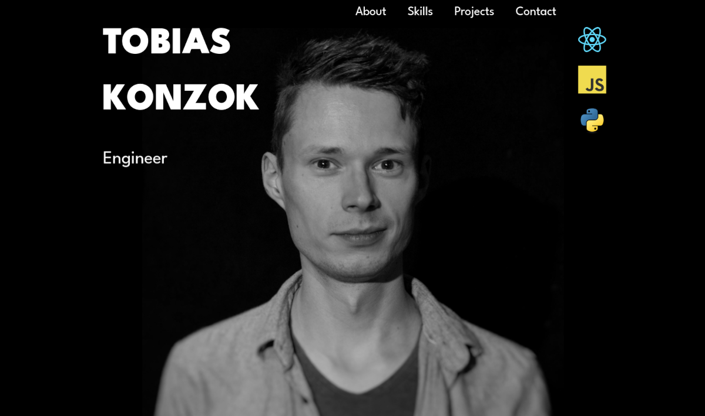
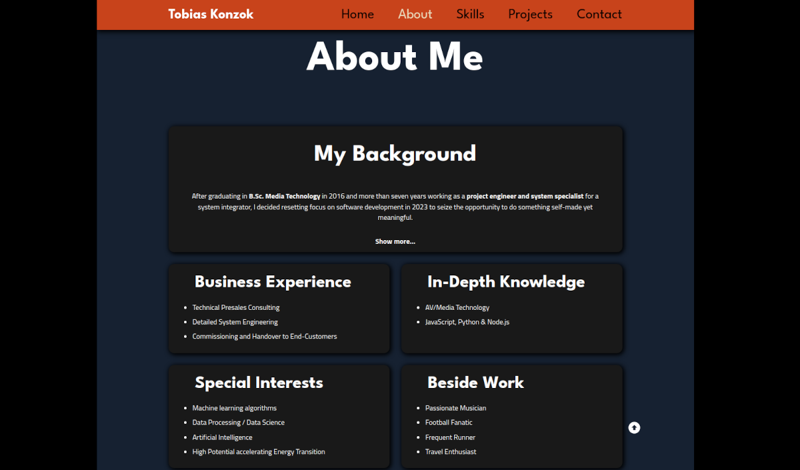
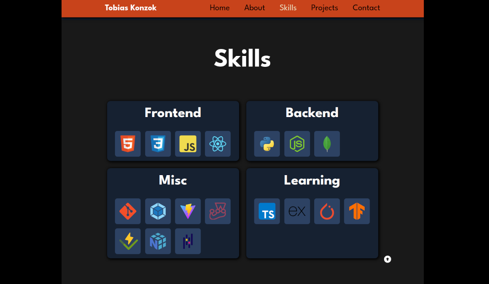
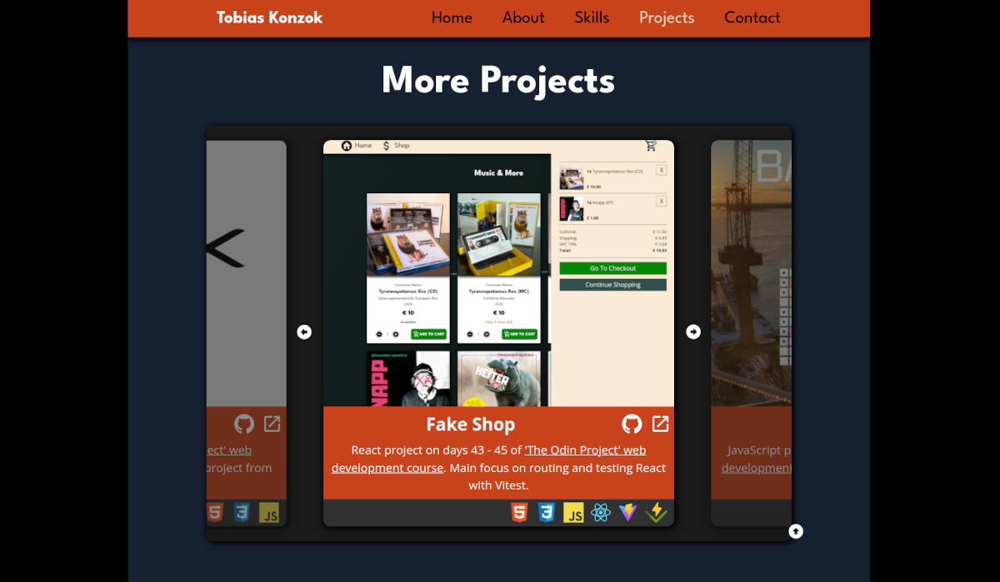
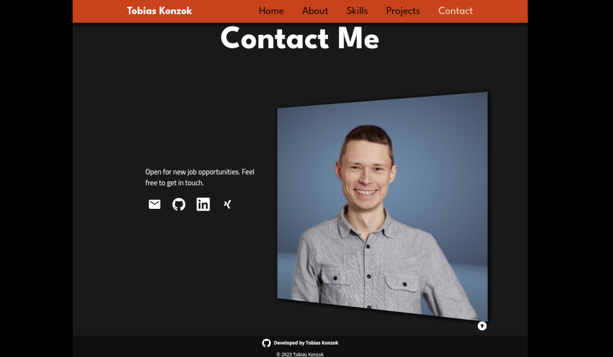

<h1 align="center">Tobias Konzok - Personal Portfolio</h1>

Personal Portfolio built with React. Containing hero, about, skills, projects and contact section.

<h2>Demo</h2>

[Live Demo](https://tobias-konzok-portfolio.vercel.app/)

<h2>Built with</h2>

- React
- JavaScript
- CSS
- HTML

 

<h2>Features</h2>

- Navigation bar, collapsing to sidebar for mobile devices, changing background color when leaving hero section
- Click on chapter to smoothly scroll to respective page
- Mobile View: Swipe from right edge to the left to open sidebar. Slide anywhere from left to right to close it
- Full responsiveness for screen sizes from 320 px width
- Animated cards in skills section showing name of skill instead of icon on hover and on tap
- Projects section presenting sample projects, containing screenshot, short description, used technologies and links to the code on GitHub and the live preview
- Preferred projects staged on top of projects section
- Other projects to be viewed by carousel, allowing to either swipe through or click left and right arrow to move to previous or next card

<h2>Screenshots</h2>

<h2>External Resources</h2>

- Icons by <a target="_blank" href="https://devicon.dev/">DEVICON</a>, <a target="_blank" href="https://pictogrammers.com/library/mdi/">Pictogrammers</a> and <a target="_blank" href="https://www.svgrepo.com/">SVG Repo</a>
- Profile Image by <a target="_blank" href="https://fotocommunity.de/fotograf/christoph-schwencke/2216245">Christoph Schwencke</a>
